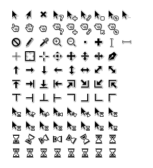

# Toolbox for X11 Mouse Cursors
(and also Windows cursors if you need them)

This collection of files enables you to create a Linux cursor theme out of an SVG file. I used it to build my cursor theme (included in this package).

For a prebuilt theme, see the releases:

## Build the Cursor theme

Clone or download the files of this repository to your local machine. To render the PNGs the program **rsvg-convert** is used. For combining the PNGs to X11 cursor files you’ll need the command line tool **xcursorgen**.

For example the generate the theme use:

    $ ./make.py -s svgs/theme.svg

The following options are available:
 * **-s** or **--shadow** Enable Shadow (without this flag the drop shadow filter will be removed)
 * **-a** or **--anicur** generate cursor files suitable for use with Windows
 * **--fps** *FPS* change the FPS for the animated cursors (default is 16.6)
 * **--sizes** *SIZES* generate cursors for the following sizes, defaults to: 24,32,48,64,96
 * **-n** *NAME* or **--name** *NAME* change the cursor theme name, defaults to
   contents of SVG `<title>` tag
 * **-o** *NAME* or **--out** *NAME* change the cursor theme output directory, defaults to
   cursor them name

## 1 Designing Your Own Cursors

If you just want to generate a theme out of the provided SVG you can skip this step and proceed with generating the PNGs. Otherwise start by editing the file *theme.svg* in the folder *svgs* with Inkscape.

### 1.1 Working with the SVG

The *theme.svg* contains several layers. On the layer *cursors* there’s a group of the different cursors. A second layer *slices* contains rectangles with the names of the individual cursors, each rectanble corresponds to the cursors bounding box.
The third layer *hotspots* marks each cursor's hotspot with a small circle.

*hotspots* and *slices* are turned invisible prior to rendering the SVG.

### 2 Rendering the PNGs

The Python file *make.py* combs through *theme.svg* and searches for rectangles on the *slices* layer. It exports the vectors in these areas to PNGs named after the rectangle’s ID/inkscape label. To start rendering use the command

    ./make.py -t svgs/theme.svg

The **-t** flag prohibits the deletion of the created PNG files in the folder *pngs/*
You may need to pass the **--force** parameter since the script prohibits running if a theme already exists in the output directoy.

#### 2.1 Cursor aliases
X11 cursors have many aliases *make.py* uses a small database in *names.txt* to genrate symlinks for each aliased cursor file.

To analyse which cursor is displayed I recommend using the theme Dummy X11 Cursors. It can be found at https://www.gnome-look.org/content/show.php?content=128170

### Instructions for Linux

To install the theme for a single user copy the theme folder into the hidden folder *.icons* in your home directory – if neccessary create this folder. You can do this with the terminal, too. Replace the *[theme-folder]* with the name of the generated folder from step 2.

    cp -r [theme-folder] ~/.local/share/icons/[theme-folder]

To install the cursor theme system-wide, copy your folder to /usr/share/icons. You’ll need to run the command as the system administrator, so you’ll be prompted for your system password:

    sudo cp -r [theme-folder] usr/share/icons/[theme-folder]

Now you have to set your cursor theme as the prefered one. Depending on your Linux distribution use the Gnome Tweak Tool or Unity Tweak Tool (there: Theme Settings).

On KDE Plasma go to Computer > System Settings > Workspace Appearence > Cursor Theme (or similar).

For GNOME use *gnome-tweaks*: Appearance > Cursor

## 4 Enjoying the Theme

If you have questions please open a github issue, I'm always happy about improvements.

I want to thank Gerhard Großmann (@charakterziffer) for cursor-toolbox and for
giving me this idea. I didn't fork https://github.com/charakterziffer/cursor-toolbox/
as this is almost a complete rewrite.
